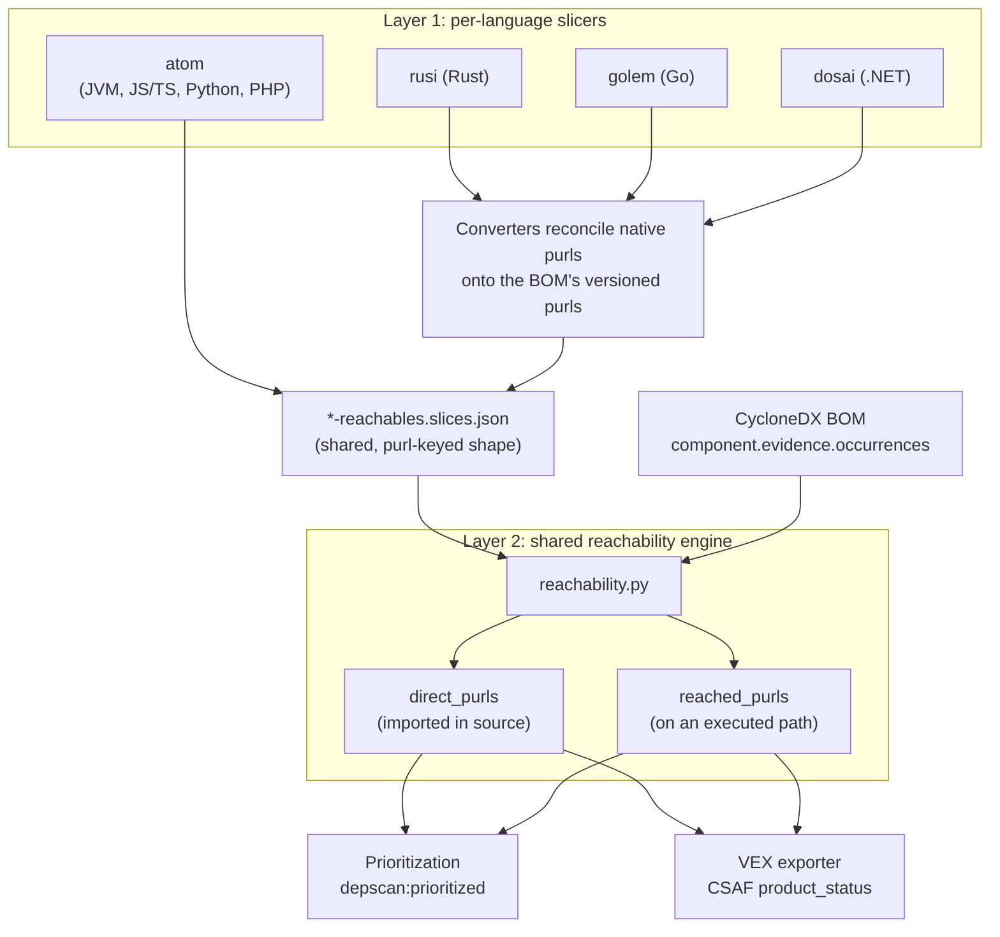

# The reachability model

## Learning objective

After reading this chapter you will be able to explain how dep-scan decides that a dependency is reachable, why it computes reachability before consulting vulnerability data, and how the two analyzers (`FrameworkReachability` and `SemanticReachability`) differ in scope. This is the conceptual foundation for every language guide and output chapter.

## Why reachability is computed first

Most reachability tools, including several commercial ones, depend on a vulnerability database that records which modules are sinks for each CVE. That approach is brittle in two ways. The databases are manually maintained and frequently incomplete, and when a CVE or an ADP enhancement is not yet published, reachability cannot be detected at all.

dep-scan inverts the dependency. It computes the reachable flows for the whole project first, using only the source and the BOM, and only then intersects that set with the vulnerability feed. A reachable package is reachable whether or not a CVE happens to mention it, so when a new advisory lands the prioritization and VEX layers can re-evaluate against an already-complete reachability picture. This also lets dep-scan narrow a reachable set further into Endpoint-Reachable, Exploitable, and Container-Escapable tiers, each of which is described in [How dep-scan prioritizes](prioritization).

## The two layers

Reachability in dep-scan is two layers that meet at a shared slice format.

The first layer is a per-language *slicer* that inspects source code (and, for .NET, compiled assemblies) and emits interprocedural data-flow and call-graph slices. Each slice is a list of flow objects, and each flow object carries a `purls` array of the versioned package URLs touched by that flow. Four slicers cover seven ecosystems: atom for Java/JVM, JavaScript/TypeScript, Python, and PHP; rusi for Rust; golem for Go; and dosai for .NET. The native tools do not all speak the same dialect, so a thin converter (for example `analysis_lib/rusi_slices.py`) reconciles each native report onto the versioned purls in the BOM. The single most important correctness detail in each converter is the purl reconciler, because native tools frequently emit versionless or subpath purls that must be mapped back to the BOM's versioned purls by name.

The second layer is a shared, purl-keyed engine in `packages/analysis-lib/src/analysis_lib/reachability.py`. It is deliberately slicer-agnostic: it consumes atom-shaped `*-reachables.slices.json` files and computes the reached purls. Because every converter normalizes its output to that shape, the engine treats a Java atom slice and a Go golem-derived slice identically.

The diagram below shows how the two layers meet at the shared slice format and where the engine's two maps come from.

## direct_purls versus reached_purls

The engine maintains two maps that drive everything downstream, and keeping them straight is the key to reading dep-scan output.

`direct_purls` is built from the CycloneDX `component.evidence.occurrences` on the BOM, which is where cdxgen records that a dependency actually appears in code (an import, a require, a using directive). A purl in `direct_purls` means the package is referenced in source, not merely declared in a manifest. `reached_purls` is built from the `purls` array on each slice flow object, so a purl lands in `reached_purls` only when it sits on a flow that the slicer traced from a real entry point. The distinction maps directly to the contrast every language chapter draws: `direct_purls` is "present and imported," `reached_purls` is "on an executed path."

This is also why an accurate, evidence-bearing BOM is a prerequisite for good reachability. If cdxgen does not persist occurrences, `direct_purls` is empty and the engine loses the ability to separate imported from merely declared. The [SBOM and evidence](sbom-and-evidence) chapter develops this point.

## The two analyzers

The `--reachability-analyzer` flag selects how far beyond `reached_purls` the engine goes. Understanding the boundary tells you when the default is enough and when you need the heavier analyzer.

`FrameworkReachability` is the default. It builds `direct_purls` from BOM occurrences and `reached_purls` from the slice flow purls, and it stops there. A purl that appears in a reachable flow is reached. It is fast, language-agnostic, and answers the question analysts ask most often: is the vulnerable package actually called? When it is enough, it is the right choice, and it is the analyzer every language chapter uses for its worked examples.

`SemanticReachability` extends FrameworkReachability with three additional signals. Endpoint reachability maps OpenAPI `x-atom-usages` usage targets onto a component's own occurrence locations, so a CVE is only endpoint-reachable when a traced flow reaches a package used by a route that is itself exposed. Service reachability associates `SERVICE_TAGS` positionally with the nearest purl in a node tag string, so a package that talks to an allow-listed service can be deprioritized. Post-build and binary reachability matches framework and cryptographic-asset components across lifecycle SBOMs (source, build, container), so a finding present in the container image but absent from source can be triaged differently. These additions require more inputs and more compute, which is why SemanticReachability is the recommended path only for compliance-grade and lifecycle work, as developed in the [Semantic reachability](../analyzers/semantic-reachability) chapter.

`off` disables reachability entirely and yields a plain version-based scan. Use it when slicing tooling is unavailable or you need a quick pass.

## How the result is consumed

The two maps flow into two places. The prioritization engine in `VDRAnalyzer.process` calls `analyze_cve_vuln` with `reached_purls`, `direct_purls`, `reached_services`, and `endpoint_reached_purls`, which is how a reachable CVE earns the `depscan:prioritized` property and a place in the Top Priority table (see [prioritization](prioritization)). The VEX exporter in `analysis_lib/vex/reachability.py` turns the same maps into CSAF status: reached purls become `known_affected`, present-but-unreached purls become `known_not_affected` with the `vulnerable_code_not_in_execute_path` justification, and purls with no reachability data become `under_investigation` (see the [CSAF VEX guide](../output/vex-csaf-guide)). Understanding the model in this chapter makes both downstream behaviors predictable.

## Summary

dep-scan computes reachable flows first, using per-language slicers that are normalized to a shared, purl-keyed slice format, and only then intersects them with vulnerability data. The engine separates `direct_purls` (imported in source) from `reached_purls` (on an executed path), and the `FrameworkReachability` default is the fast, sufficient choice for most triage while `SemanticReachability` adds endpoint, service, and post-build tiers for compliance work. The next chapter, [How dep-scan prioritizes](prioritization), shows how these maps become the Top Priority table you see in the console.
