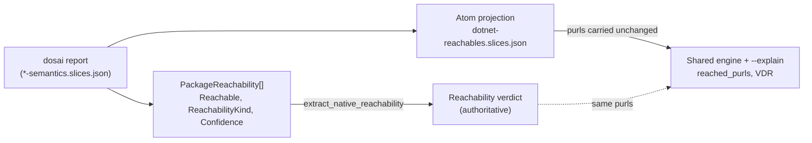

# .NET reachability with dosai

## Learning objective

After this chapter you will be able to run dep-scan reachability on a .NET project, explain how dosai produces both native reachability facts and an atom-shaped projection, and predict which NuGet packages will be marked Reachable versus merely referenced. You will also know why a restored tree matters for versioned purls and how to choose between source and assembly inspection.

## What dosai is and when to use it

[dosai (Dotnet Source and Assembly Inspector)](https://github.com/owasp-dep-scan/dosai) is the native analyzer dep-scan uses for the .NET family (C#, VB, F#, R). It is shipped prebuilt via cdxgen-plugins-bin. dosai inspects source through Roslyn and assemblies through Reflection and IL, and it emits a call graph, interprocedural source-to-sink data-flow slices, explicit per-package reachability, weakness candidates, and dangerous-API reachability. The per-package reachability is the distinctive feature: each `PackageReachability` entry states `Reachable`, `ReachabilityKind`, `Confidence`, `EvidenceKinds`, and `SourceLocations`, which is strictly richer than the atom flow shape. dep-scan consumes those native facts directly for the reachability verdict and additionally emits an atom-shaped projection so the shared engine and the `--explain` renderer light up without engine changes.

The practical effect is the same reachable-versus-present semantics every other language enjoys. A vulnerable NuGet package whose API is actually called (for example `Newtonsoft.Json.JsonConvert.DeserializeObject` on a controlled input) is marked Reachable, while a package that is merely referenced in a `.csproj` but never called is not. Reachability is on by default for .NET once the slices are present, so for most projects you scan with the research profile and read the Reachable insights.

## Prerequisites

dosai needs a .NET runtime to load, and the quality of purl attribution depends on the tree state.

- A .NET runtime, verified by `dotnet --version`. A self-contained `-full` dosai binary (from the [dosai releases](https://github.com/owasp-dep-scan/dosai/releases)) bundles the runtime and needs no SDK.
- cdxgen and dep-scan, installed by `npm install -g @cyclonedx/cdxgen` and `pip install owasp-depscan`.
- The dosai binary, resolved automatically (see below) or supplied explicitly.
- A restored tree for the best versioned NuGet purls: `project.assets.json` and `*.deps.json` present. dosai falls back to versionless `System.*` framework purls otherwise.

## How dep-scan runs dosai

Under `--profile research`, which dep-scan forces when reachability is on, cdxgen runs dosai and persists the combined native report, containing `Metadata`, `methods`, and `dataflows`, to the `*-semantics.slices.json` path. dep-scan consumes that persisted report as the primary path and does not spawn dosai itself when cdxgen and the plugins are available. dosai is invoked directly only as a fallback, running `dataflows --pattern-packs all` and `methods`. dep-scan runs `dataflows` and `methods` with pattern packs set to `all`.

dep-scan resolves the dosai binary the same way cdxgen does. It checks the `DOSAI_CMD` environment variable, then `DEPSCAN_DOSAI_BINARY`, then `dosai` or `Dosai` on `PATH`, then the bundled `cdxgen-plugins-bin` layout at `<pluginsDir>/dosai/dosai-<platform>-<arch>`. When cdxgen spawns, dep-scan propagates `DOSAI_CMD` and `CDXGEN_PLUGINS_DIR` to the subprocess so both sides use the same binary. If dosai cannot be found, .NET reachability is skipped with a warning and never a crash, and other languages are unaffected.

dep-scan probes `dotnet --version` and skips gracefully with a diagnostic when the runtime is absent. It does not run `dotnet restore` itself, because restore touches the network and the package source, which is unsafe on untrusted repositories; you are expected to restore before scanning.

## Example invocations

The hermetic fixtures under `test/data/dosai/repos/` let you reproduce the reachable-versus-present contrast offline. Both `reachable-app` and `unreachable-app` reference `Newtonsoft.Json 13.0.3`, but only `reachable-app` actually calls it.

```shell
# Reachable case: Newtonsoft.Json is referenced AND reached via a deserialization sink
depscan -i ./test/data/dosai/repos/reachable-app -o ./reports -t dotnet --profile research --explain

# Point dep-scan at a specific dosai binary
DEPSCAN_DOSAI_BINARY=/path/to/dosai depscan -i ./test/data/dosai/repos/reachable-app -o ./reports -t dotnet --profile research --explain

# Force source inspection explicitly
depscan -i ./test/data/dosai/repos/reachable-app -o ./reports -t dotnet --dotnet-analyzer-mode source --explain
```

The control is `unreachable-app`, which references the same `Newtonsoft.Json 13.0.3` in its `.csproj` but never calls any Newtonsoft API.

```shell
# Present-but-unreachable case: package referenced, never called
depscan -i ./test/data/dosai/repos/unreachable-app -o ./reports -t dotnet --profile research --explain
```

Reachability is on by default (`--reachability-analyzer FrameworkReachability`). The `--dotnet-analyzer-mode` flag selects how dosai inspects the target. The values are:

- `auto` (default): inspects source when a source tree is present, falls back to assembly inspection for bin- or `.nupkg`-only inputs.
- `source`: forces Roslyn-based C#/VB/F#/R source inspection.
- `assembly`: forces Reflection-based `.dll`/`.exe` inspection.

Switch to `SemanticReachability` only when you also want reached services and endpoints attributed.

## Analysis walkthrough

Consider the `reachable-app` source. Its `Run` method takes a `TextReader input`, calls `input.ReadLine()`, and passes the result to `Newtonsoft.Json.JsonConvert.DeserializeObject<EchoRequest>(line)`. dosai recognizes the fully-qualified `DeserializeObject` call seeded by a method-parameter source as a deserialization sink, so it flags the package with `Reachable=true`, `ReachabilityKind=DataFlowNode`, and `Confidence=High`. dep-scan consumes that native fact directly: the `Newtonsoft.Json@13.0.3` purl lands in `reached_purls` because `extract_native_reachability` maps the native facts straight into the reached-purl map with dosai's own confidence. The atom projection then emits a two-node flow carrying the versioned purl so the shared engine and the `--explain` renderer show a meaningful source-to-sink path.

A representative projection (drawn from the committed `test/data/dotnet-reachables.slices.json` fixture, trimmed for readability) shows the shape the engine consumes. This fixture captures a different sample app (an MCP server whose sink is `System.Text.Json.JsonSerializer.Deserialize`), but the projection shape is identical to what `reachable-app` produces for `JsonConvert.DeserializeObject`:

```json
{
  "flows": [
    {
      "code": "TextReader? input",
      "parentFileName": "McpServer.cs",
      "parentMethodName": "McpServer.Run",
      "label": "METHOD_PARAMETER_IN",
      "tags": "pkg:nuget/System.Text.Json@10.0.0, rpc, deserialization, dotnet, Data flows from dfn61 to Deserialize argument 0."
    },
    {
      "code": "System.Text.Json.JsonSerializer.Deserialize(...)",
      "parentFileName": "McpServer.cs",
      "isExternal": true,
      "label": "CALL",
      "tags": "pkg:nuget/System.Text.Json@10.0.0, rpc, deserialization, dotnet, Data flows from dfn61 to Deserialize argument 0."
    }
  ],
  "purls": ["pkg:nuget/System.Text.Json@10.0.0"]
}
```

Notice the versioned purl in both the `tags` string and the `purls` array. That versioned purl is what the reconciler matches against the BOM component, and it is what makes the flow count as evidence that the *affected* version is the one installed.

The contrast with `unreachable-app` is precise. That fixture references `Newtonsoft.Json 13.0.3` in its `.csproj` (and in its restored `.deps.json`) but its `Run` method only writes `line.ToUpper()` to the console and never calls any Newtonsoft API. dosai therefore produces no `PackageReachability` entry with `Reachable=true` for the package, at most a low-confidence Dependency-level reference, so `reached_purls` stays empty for `Newtonsoft.Json`. The package is present in the BOM and would appear in the full Vulnerability Disclosure Report, but it carries `depscan:prioritized=false` and no reachable insight, which is the triage signal to move on. This is the cleanest illustration of reachability value in the fixture set, because the two apps are identical except for the single call.

## Native facts versus the atom projection

It is worth being precise about the two outputs, because .NET is the only slicer that produces a native reachability verdict rather than just flows. The native `PackageReachability[]` is the reachability truth: dep-scan treats its `Reachable` flag, `ReachabilityKind`, and `Confidence` as authoritative. The atom-shaped `dotnet-reachables.slices.json` is a *derived* projection that faithfully carries every native-reachable purl in its flows' `purls` lists so the existing engine's `reached_purls` loop picks them up unchanged, and so the `--explain` renderer can show a source-to-sink path. In practice you read both: the projection drives the console and the VDR, while the native report (in `*-semantics.slices.json`) is where you go for dosai's own confidence and evidence kinds when you need to defend a verdict.



## Reading the artifacts

Three files in the reports directory tell the story. The `dotnet-reachables.slices.json` is the atom projection; check here first if no package is Reachable, because an empty or purl-less file explains the silence. The `*-semantics.slices.json` carries the combined native report with the `PackageReachability[]` entries, which is the authoritative source for confidence and evidence kinds. The `<base>.vdr.json` carries the `depscan:prioritized` property and the `depscan:insights` text ("Reachable", "Endpoint-Reachable") per vulnerability; filter the `vulnerabilities` array on those properties to reconstruct the prioritized set, as described in the [VDR guide](../output/vdr-guide). When you generate a VEX document with `--csaf`, a reached package becomes `known_affected` while a present-but-unreached package becomes `known_not_affected` carrying `vulnerable_code_not_in_execute_path`, as covered in the [CSAF VEX guide](../output/vex-csaf-guide).

## Troubleshooting

If dosai reports that the .NET runtime is missing, install a runtime or switch to a self-contained `-full` dosai binary from the dosai releases. If slices are generated but packages are Reachable with versionless `System.*` purls, the tree was not restored; run `dotnet restore` (on a trusted tree) before scanning so dosai can attribute versioned NuGet purls. If dosai does not flag an expected deserialization sink, check that the call is fully qualified (`Newtonsoft.Json.JsonConvert.DeserializeObject` or `System.Text.Json.JsonSerializer.Deserialize`) and seeded by a method-parameter source; the dosai fixture README documents that unqualified calls relying on a `using` directive do not reliably bind the sink symbol in minimal projects. The existing [dotnet-podcasts framework analysis lesson](../Lessons/dotnet-framework-analysis) complements this chapter with a larger public-project walkthrough.

## Summary

dosai gives .NET the same reachable-versus-present semantics every other language enjoys in dep-scan, with the added precision of an explicit native reachability verdict per package. The `reachable-app` fixture shows `Newtonsoft.Json@13.0.3` marked Reachable with high confidence because `JsonConvert.DeserializeObject` is called on a controlled input, while `unreachable-app` shows the same package merely referenced and therefore never reached. Restore your tree for versioned purls, pick source or assembly mode with `--dotnet-analyzer-mode`, and read the prioritized set from the VDR or the CSAF status from the VEX. The neighboring chapters [Rust reachability](rust-reachability) and [Go reachability](go-reachability) cover the other native slicers, the [Framework reachability](../analyzers/framework-reachability) chapter explains the engine these slicers feed, and the compliance story continues in the [VDR guide](../output/vdr-guide) and [CSAF VEX guide](../output/vex-csaf-guide).
