```mermaid
graph TD
    A[main] --> B["build_args()"];
    B --> C["run_depscan(cli_args)"];
    C --> D{"args.server_mode?"};
    D -- Yes --> E["run_server(args)"];
    D -- No --> F{"args.no_banner?"};
    F -- No --> G["print(LOGO)"];
    F -- Yes --> H;
    G --> H;
    H --> I["set_project_types(args, src_dir)"];
    I --> J{"args.search_purl?"};
    J -- Yes --> K["perform_risk_audit = True"];
    J -- No --> L;
    K --> L;
    L --> M["db = db_lib.get()"];
    M --> N["loop through project_types_list"];
    N --> O{"args.search_purl or args.bom?"};
    O -- Yes --> P["bom_file assignment"];
    O -- No --> Q["create_bom"];
    Q --> R{"creation_status?"};
    R -- No --> S["continue"];
    R -- Yes --> T["get_pkg_list(bom_file)"];
    T --> U{"pkg_list?"};
    U -- No --> V["continue"];
    U -- Yes --> W["scoped_pkgs = utils.get_pkgs_by_scope(pkg_list)"];
    W --> X{"'license' in project_types_list or 'license' in args.profile?"};
    X -- Yes --> Y["analyse_licenses"];
    X -- No --> Z;
    Y --> Z;
    Z --> AA{"project_type in risk_audit_map and perform_risk_audit?"};
    AA -- Yes --> AB["risk_audit & analyse_pkg_risks"];
    AA -- No --> AC;
    AB --> AC;
    AC --> AD{"project_type in type_audit_map?"};
    AD -- Yes --> AE["audit"];
    AD -- No --> AF;
    AE --> AF;
    AF --> AG{"project_type in ('podman', 'docker', ...)?"};
    AG -- Yes --> AH["audit npm packages"];
    AG -- No --> AI;
    AH --> AI;
    AI --> AJ{"0 in db_lib.stats()?"};
    AJ -- Yes --> AK["run_cacher = True"];
    AJ -- No --> AL;
    AK --> AL;
    AL --> AM["sources_list setup"];
    AM --> AN{"run_cacher or args.sync?"};
    AN -- Yes --> AO["download/sync vulnerability data"];
    AN -- No --> AP;
    AO --> AP;
    AP --> AQ{"len(pkg_list) > 1?"};
    AQ -- Yes --> AR["search_pkgs"];
    AQ -- No --> AS;
    AR --> AS;
    AS --> AT["find_purl_usages"];
    AT --> AU["summarise"];
    AU --> AV{"args.explain?"};
    AV -- Yes --> AW["explainer.explain"];
    AV -- No --> AX;
    AW --> AX;
    AX --> AY{"args.csaf?"};
    AY -- Yes --> AZ["export_csaf"];
    AY -- No --> BA;
    AZ --> BA;
    BA --> BB["console.save_html"];
    BB --> BC["utils.export_pdf"];
    BC --> BD{"args.report_template and os.path.isfile(args.report_template)?"};
    BD -- Yes --> BE["utils.render_template_report"];
    BD -- No --> BF;
    BE --> BF;
    BF --> CG{"args.threatdb_server and (args.threatdb_username or args.threatdb_token)?"};
    CG -- Yes --> DH["submit_bom"];
    CG -- No --> II;
    E --> II;
    S --> II;
    V --> II;
    P --> T;


```

{/* ```mermaid 
graph TD
    subgraph Main
        A[main] --> B(build_args);
        B --> C(run_depscan);
    end

    C --> D{args.server_mode?};
    D -- Yes --> E[run_server];
    D -- No --> F{args.no_banner?};
    F -- No --> G["print(LOGO)"];
    F -- Yes --> H;
    G --> H;

    subgraph Pre-Scan
        H --> I(set_project_types);
        I --> J{args.search_purl?};
        J -- Yes --> K[perform_risk_audit = True];
        J -- No --> L;
        K --> L;
        L --> M(db = db_lib.get());
    end

    M --> N{loop through project_types_list};
    N --> O{args.search_purl or args.bom?};
    O -- Yes --> P(bom_file assignment);
    O -- No --> Q(create_bom);
    Q --> R{creation_status?};
    R -- No --> S[continue];
    R -- Yes --> T(get_pkg_list);

    subgraph Package Processing
        T --> U{pkg_list?};
        U -- No --> V[continue];
        U -- Yes --> W(scoped_pkgs);
        W --> X{"license" condition?};
        X -- Yes --> Y[analyse_licenses];
        X -- No --> Z;
        Y --> Z;
        Z --> AA{risk_audit condition?};
        AA -- Yes --> AB[risk_audit & analyse_pkg_risks];
        AA -- No --> AC;
        AB --> AC;
        AC --> AD{project_type in type_audit_map?};
        AD -- Yes --> AE[audit];
        AD -- No --> AF;
        AE --> AF;
        AF --> AG{npm audit condition?};
        AG -- Yes --> AH[audit npm packages];
        AG -- No --> AI;
        AH --> AI;
        AI --> AJ{db empty?};
        AJ -- Yes --> AK[run_cacher = True];
        AJ -- No --> AL;
        AK --> AL;
        AL --> AM(sources_list setup);
        AM --> AN{run_cacher or args.sync?};
        AN -- Yes --> AO(download/sync data);
        AN -- No --> AP;
        AO --> AP;
        AP --> AR(search_pkgs);
        AR --> AS(find_purl_usages);
        AS --> AU(summarise);
    end

    subgraph Post-Scan
        AU --> AV{args.explain?};
        AV -- Yes --> AW[explainer.explain];
        AV -- No --> AX;
        AW --> AX;
        AX --> AY{args.csaf?};
        AY -- Yes --> AZ[export_csaf];
        AY -- No --> BA;
        AZ --> BA;
        BA --> BB[console.save_html];
        BB --> BC[utils.export_pdf];
        BC --> BD{report template condition?};
        BD -- Yes --> BE[render_template_report];
        BD -- No --> BF;
        BE --> BF;
        BF --> CG{threatdb condition?};
        CG -- Yes --> DH[submit_bom];
        CG -- No --> II;
    end

    E --> II;
    S --> II;
    V --> II;
    P --> T;
```
*/}

```mermaid
graph TD
    subgraph Main
        A[main] --> B["build_args"];
        B --> C["run_depscan"];
    end

    C --> D{"args.server_mode?"};
    D -- Yes --> E["run_server"];
    D -- No --> F{"args.no_banner?"};
    F -- No --> G["print(LOGO)"];
    F -- Yes --> H;
    G --> H;

    subgraph Pre-Scan
        H --> I["set_project_types"];
        I --> J{"args.search_purl?"};
        J -- Yes --> K["perform_risk_audit = True"];
        J -- No --> L;
        K --> L;
        L --> M["db = db_lib.get()"];
    end

    M --> N{"loop through project_types_list"};
    N --> O{"args.search_purl or args.bom?"};
    O -- Yes --> P["bom_file assignment"];
    O -- No --> Q["create_bom"];
    Q --> R{"creation_status?"};
    R -- No --> S["continue"];
    R -- Yes --> T["get_pkg_list"];

    subgraph Package Processing
        T --> U{"pkg_list?"};
        U -- No --> V["continue"];
        U -- Yes --> W["scoped_pkgs"];
        W --> X{"license" condition?};
        X -- Yes --> Y["analyse_licenses"];
        X -- No --> Z;
        Y --> Z;
        Z --> AA{"risk_audit condition?"};
        AA -- Yes --> AB["risk_audit & analyse_pkg_risks"];
        AA -- No --> AC;
        AB --> AC;
        AC --> AD{"project_type in type_audit_map?"};
        AD -- Yes --> AE["audit"];
        AD -- No --> AF;
        AE --> AF;
        AF --> AG{"npm audit condition?"};
        AG -- Yes --> AH["audit npm packages"];
        AG -- No --> AI;
        AH --> AI;
        AI --> AJ{"db empty?"};
        AJ -- Yes --> AK["run_cacher = True"];
        AJ -- No --> AL;
        AK --> AL;
        AL --> AM["sources_list setup"];
        AM --> AN{"run_cacher or args.sync?"};
        AN -- Yes --> AO["download/sync data"];
        AN -- No --> AP;
        AO --> AP;
        AP --> AR["search_pkgs"];
        AR --> AS["find_purl_usages"];
        AS --> AU["summarise"];
    end

    subgraph Post-Scan
        AU --> AV{"args.explain?"};
        AV -- Yes --> AW["explainer.explain"];
        AV -- No --> AX;
        AW --> AX;
        AX --> AY{"args.csaf?"};
        AY -- Yes --> AZ["export_csaf"];
        AY -- No --> BA;
        AZ --> BA;
        BA --> BB["console.save_html"];
        BB --> BC["utils.export_pdf"];
        BC --> BD{"report template condition?"};
        BD -- Yes --> BE["render_template_report"];
        BD -- No --> BF;
        BE --> BF;
        BF --> CG{"threatdb condition?"};
        CG -- Yes --> DH["submit_bom"];
        CG -- No --> II;
    end

    E --> II;
    S --> II;
    V --> II;
    P --> T;
```

