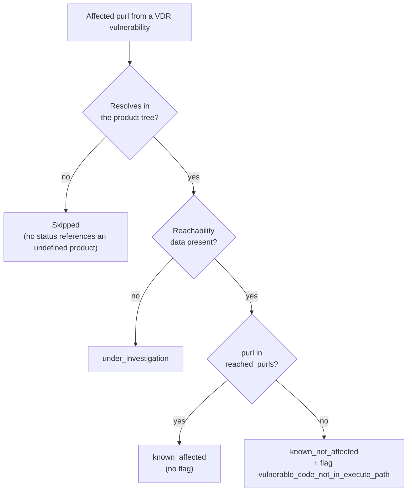

# Generating CSAF VEX with reachability

## Learning objective

After this chapter you will be able to generate a CSAF VEX document from a dep-scan run, configure its publisher and tracking metadata, and explain to a VEX consumer how reachability translates into machine-readable status and justification. This is the primary artifact for compliance and product-security experts who produce or consume VEX.

## What VEX is and why reachability changes it

A Vulnerability Exploitability eXchange (VEX) document tells a consumer, per product and per vulnerability, whether a given product is affected. Without reachability, a VEX statement can only say "a fixed version exists" or leave the status at "under investigation", which forces the consumer to treat every dependency CVE as potentially exploitable. dep-scan's VEX is different because it folds reachability into the assessment: dependencies whose code is not on an executed path are marked `known_not_affected` with a machine-readable justification, not merely noted as having a fix available. That is the whole point of a dep-scan VEX, and it is what makes the document useful for suppressing non-exploitable dependency CVEs at scale.

dep-scan emits VEX as an OASIS Common Security Advisory Framework (CSAF) document, defaulting to CSAF 2.1 with an option for 2.0. The CSAF VEX content lives under `packages/analysis-lib/src/analysis_lib/vex/`, and the behavior described here is the source of truth for the `contrib/CSAF_README.md` operator notes.

## Generating a VEX document

Pass `--csaf` to any dep-scan run that produces a VDR. dep-scan writes the document into the reports directory with a filename derived from the BOM base name and a `.csaf.json` suffix.

```shell
depscan --bom reports/sbom-build.cdx.json --reports-dir reports --src . --csaf
```

Select the target schema with `--csaf-version`; the default is `2.1`, and `2.0` is available for consumers that require it.

```shell
depscan --bom reports/sbom-build.cdx.json --reports-dir reports --src . --csaf --csaf-version 2.0
```

Reachability is what makes the VEX meaningful, so combine `--csaf` with the reachability workflow appropriate to your project. For a single-language scan, that is `--profile research`; for lifecycle and semantic coverage, use the `--bom-dir` workflow described in [Semantic reachability](../analyzers/semantic-reachability).

## Output naming and the VDR safety guarantee

The output filename is derived from the BOM base name with the `.csaf.json` suffix. For `sbom-js-build.cdx.json` you get `sbom-js-build.csaf.json`, and for a `.vdr.json` input you get the matching `.csaf.json`. The emit layer asserts that the output path always ends in `.csaf.json` and never equals the BOM or VDR path, so the CSAF export cannot overwrite the VDR. This is intentional: the VDR is the analyst's record of every finding, and the VEX is the compliance projection of the same data, so the two must coexist. A regression that allowed the CSAF step to clobber the VDR existed in v6 and is now asserted against in the test suite.

## The csaf.toml metadata

If no `csaf.toml` exists in the target directory, dep-scan writes a starter template and continues with sensible defaults, so you do not need to run the command twice. Edit the toml to customize the publisher and tracking metadata, then rerun to pick up your changes. The repository ships a commented example at `contrib/csaf.toml`.

The toml sets the metadata outside the vulnerabilities section. The required fields are the document category and title, the publisher category, name, and namespace, and the tracking status and version. The document category defaults to `csaf_vex`. Valid publisher categories are coordinator, discoverer, other, translator, user, and vendor. Notes require non-empty text (notes without text are dropped), and references require a summary and a url. The product tree is built automatically from the CycloneDX BOM components, with every component's purl becoming its product id, so no manual product-tree import is needed.

Tracking has a few invariants worth knowing. The `revision_history` is always non-empty because CSAF requires at least one revision entry even for draft documents. The document `version` equals the latest revision number. If you leave dates blank, dep-scan uses the current UTC time. The `id` is best set by your issuing authority; when left blank, dep-scan generates one from the date and version.

## The reachability-to-status mapping

This is the central compliance story, and it is encoded in `analysis_lib/vex/reachability.py`. The classifier reads the affected purls from each VDR vulnerability and bins them into CSAF `product_status` buckets based on the reached-purls map. The decision, applied per affected purl, is shown below.




| Reachability          | CSAF `product_status` | Flag / justification                              |
|-----------------------|-----------------------|---------------------------------------------------|
| Reachable             | `known_affected`      | (none)                                            |
| Unreachable           | `known_not_affected`  | `component_not_present` / `vulnerable_code_not_in_execute_path` |
| Unknown / no data     | `under_investigation` | (none)                                            |

The logic is precise. When reachability data is absent, every affected purl lands in `under_investigation`, which is the honest status when no slicing was performed. When reachability data is present, a purl found in `reached_purls` (or its product id) lands in `known_affected` with no flag. A purl that is affected but not reached lands in `known_not_affected`, and the classifier attaches a flag whose label is `vulnerable_code_not_in_execute_path`, scoped to that product. Only product ids that resolve in the product tree are emitted, so a status or flag can never reference an undefined product. This is what lets a VEX consumer mechanically suppress a dependency CVE: the vulnerable code is present in the build but not on an executed path, and the flag says so in a machine-readable way.

## A representative VEX fragment

The fragment below is representative of the structure dep-scan produces, derived from the schema-valid demo fixture used in the dep-scan test suite. It shows one reachable vulnerability (`express`, `known_affected`) and one unreachable vulnerability (`left-pad`, `known_not_affected` with the execute-path flag), which is the contrast that makes VEX useful.

```json
{
  "document": {
    "category": "csaf_vex",
    "title": "Your Title",
    "publisher": {
      "category": "vendor",
      "name": "Vendor McVendorson",
      "namespace": "https://appthreat.com"
    },
    "tracking": {
      "status": "draft",
      "version": "1",
      "current_release_date": "2025-07-23T10:00:00Z",
      "initial_release_date": "2025-07-23T10:00:00Z",
      "revision_history": [
        {"date": "2025-07-23T10:00:00Z", "number": "1", "summary": "Initial draft"}
      ]
    }
  },
  "product_tree": {
    "full_product_names": [
      {"product_id": "pkg:npm/express@4.22.2", "name": "express@4.22.2"},
      {"product_id": "pkg:npm/left-pad@1.3.0", "name": "left-pad@1.3.0"}
    ]
  },
  "vulnerabilities": [
    {
      "cve": "CVE-2024-10001",
      "title": "Reachable vuln in express.",
      "product_status": {
        "known_affected": ["pkg:npm/express@4.22.2"]
      },
      "flags": [],
      "metrics": [
        {"content": {"cvss_v3": {"version": "3.1", "vectorString": "CVSS:3.1/AV:N/AC:L/PR:N/UI:N/S:U/C:H/I:H/A:H", "baseScore": 9.8, "baseSeverity": "critical"}}}
      ]
    },
    {
      "cve": "CVE-2024-20002",
      "title": "Unreachable vuln in left-pad.",
      "product_status": {
        "known_not_affected": ["pkg:npm/left-pad@1.3.0"]
      },
      "flags": [
        {"label": "vulnerable_code_not_in_execute_path", "product_ids": ["pkg:npm/left-pad@1.3.0"]}
      ]
    }
  ]
}
```

Read the two entries together. The reachable `express` finding carries no flag because the code is on an executed path and the product is genuinely affected. The unreachable `left-pad` finding carries the `vulnerable_code_not_in_execute_path` flag scoped to its product id, which is the machine-readable justification a consumer uses to suppress it. That is the entire reachability-to-VEX mechanism in two rows.

The mapping is language-agnostic because CSAF VEX is purl-keyed. The dep-scan test suite asserts the same behavior for Rust, Go, and .NET: a reached `pkg:cargo`, `pkg:golang`, or `pkg:nuget` purl maps to `known_affected`, while a present-but-unreached purl of any type maps to `known_not_affected` with the execute-path flag. So whether your reachability came from atom, rusi, golem, or dosai, the VEX tells the same compliance story.

## Schema validation

Every generated document is validated in-process against the official CSAF 2.0 or 2.1 JSON schema bundled with the `analysis_lib.vex` package, so validation runs fully offline. Any validation errors are logged while the document is still written for debugging. Note that CSAF 2.0 has no `cvss_v4` slot, so CVSS v4 vectors are retained only when targeting 2.1; CVSS v2 and v3 are always mapped. Validation resolves the FIRST CVSS schemas from bundled copies, which is why no network access is needed.

To validate a document manually, use `check-jsonschema` against the bundled schema:

```bash
pip install check-jsonschema
check-jsonschema --schemafile contrib/csaf_2.0_schema.json path/to/your.csaf.json
```

dep-scan also ships `contrib/vex-validate.py` as a convenience validator for generated documents.

## CSAF 2.0 versus 2.1

The two schema versions differ in ways that affect what dep-scan can emit. CSAF 2.1 carries a `$schema` URI and a `document.csaf_version` of `2.1`, and it supports the `cvss_v4` score family and multiple CWEs per vulnerability in a `cwes` array. CSAF 2.0 omits the `$schema` URI, sets `document.csaf_version` to `2.0`, has no `cvss_v4` slot, and allows only a single `cwe` per vulnerability, so any additional CWEs become developer notes. CWE ids are always emitted as `CWE-<n>` with the exact MITRE name, and a CWE whose name is unknown is omitted entirely rather than emitted as a placeholder. Choose 2.0 only when a downstream consumer requires it; otherwise the 2.1 default gives you the richer document.

## How a VEX consumer uses the document

A VEX consumer, whether a vulnerability-management platform, an SBOM hub, or a gate in a deployment pipeline, walks the `vulnerabilities` array and applies the `product_status` and `flags` to its own findings. The consumer suppresses a CVE for a product when that product appears under `known_not_affected` with a flag such as `vulnerable_code_not_in_execute_path`, because the justification is machine-readable and auditable. It escalates a CVE when the product appears under `known_affected`. And it leaves a CVE open for human review when the product appears under `under_investigation`, which is the correct status when reachability was not computed. This is the analyst-to-compliance thread: the `reached_purls` map an analyst reads in the VDR becomes the `known_affected` and `known_not_affected` buckets a compliance reviewer relies on, with no manual translation in between. The [VDR guide](vdr-guide) is the analyst's view of the same data.

## Summary

The CSAF VEX document is the compliance projection of a dep-scan run, and reachability is what makes it actionable rather than a restatement of version matches. Generate it with `--csaf`, configure the publisher and tracking metadata in `csaf.toml`, rely on the emit layer to keep the VDR and the VEX separate, and read the reachability-to-status mapping as the core value: reached dependencies are `known_affected`, present-but-unreached dependencies are `known_not_affected` with `vulnerable_code_not_in_execute_path`, and unknown dependencies are honestly `under_investigation`. The document validates offline against the bundled CSAF schema, is purl-keyed and therefore language-agnostic, and gives a VEX consumer a defensible, machine-readable way to suppress non-exploitable dependency CVEs. The concepts behind the verdicts are in [How dep-scan prioritizes](../concepts/prioritization), and the analyst's view of the same data is in the [VDR guide](vdr-guide).
